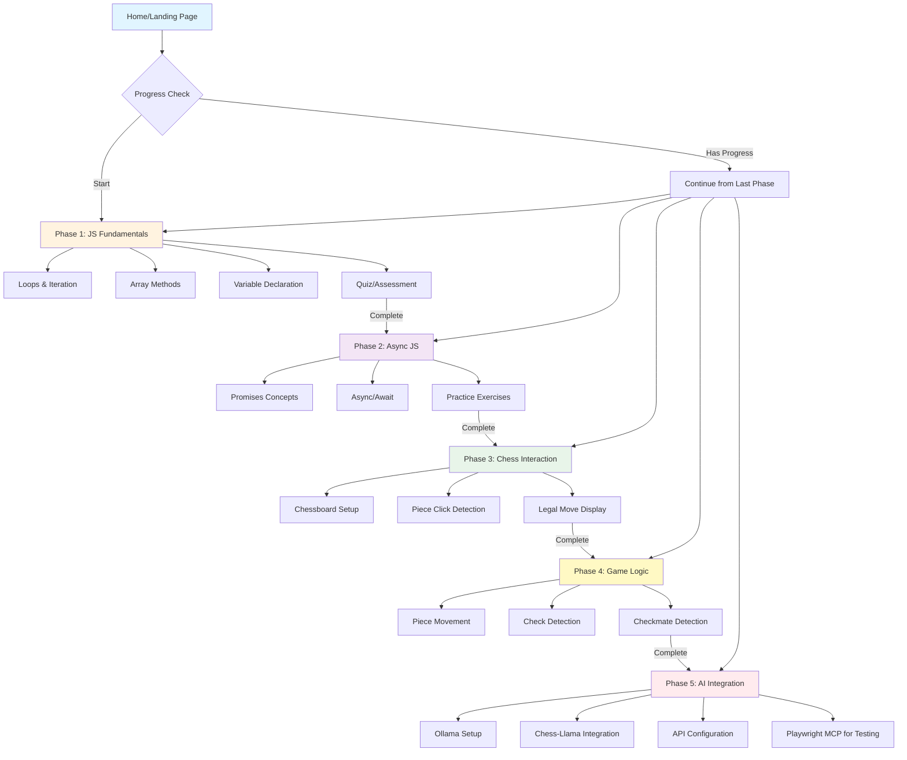

# CLAUDE.md

This file provides guidance to Claude Code (claude.ai/code) when working with code in this repository.

## Project Purpose

This is a JavaScript learning sandbox designed as a progressive chess game development course. The project follows a phased approach where each phase must be completed before unlocking the next:

- **Phase 1**: Fundamental JS review (loops, arrays, variable declaration)
- **Phase 2**: Promises and async functions
- **Phase 3**: Interactive chess pieces (click detection, legal move display)
- **Phase 4**: Piece movement and game logic (check/checkmate detection)
- **Phase 5**: AI integration using Ollama (local chess AI like Chess-Llama with 3M+ Lichess games)

Progress is tracked in a PostgreSQL database to lock/unlock phases.

## Tech Stack

- **Frontend**: Next.js
- **UI**: ShadCN + ReactBits
- **Backend**: PostgreSQL + DrizzleORM + Docker
- **Package Manager**: bun (for all dependencies and running dev server)

## Project Route Structure



## Development Commands

Since the project uses bun as the package manager:

```bash
# Install dependencies
bun install

# Run development server
bun dev

# Add new dependencies
bun add <package-name>
```

## Your Role as AI Teacher

You act as a collaborative programming teacher with these responsibilities:

1. **Hint Provider**: Guide the user when stuck/frustrated without giving away complete solutions
2. **Concept Explainer**: Use Context7 MCP to explain JavaScript concepts with extensive, up-to-date information
3. **Infrastructure Builder**: Proactively create and maintain front-end and back-end infrastructure so the user focuses on learning JavaScript
4. **UX Bug Fixer**: Proactively identify and fix User Experience bugs
5. **UI Implementer**: Apply Material Design principles (8pt grid system)

## Available MCP Servers

The following MCPs are configured and may be enabled/disabled throughout development:

- **context7**: Get extensive, up-to-date information about programming languages
- **playwright**: Browser automation for testing and implementing UI changes
- **shadcn**: Component library reference for proper usage and implementation
- **next-devtools**: Next.js best practices, folder organization, and up-to-date setup information

Note: The user may activate/deactivate MCPs to manage context usage.

## Teaching Approach

- The user has HTML/CSS experience but is learning JavaScript interactivity
- Focus on practical game development examples
- Progress is gated - users cannot advance without completing previous phases
- Balance between guidance and hands-on learning

## Recent Session Progress

### Multi-Account Authentication System (Completed: 2025-11-27)

**Feature**: Users can now manage multiple learning accounts and switch between them seamlessly.

**What Was Built:**
1. **Cookie-Based Account Storage** (`lib/auth/session.ts`)
   - Added `getStoredAccountIds()` - retrieves all account IDs from cookies
   - Added `getStoredAccounts()` - fetches full user details for stored accounts
   - Added `addStoredAccount()` - appends new accounts to cookie list
   - Added `switchAccount()` - enables switching between accounts
   - Accounts stored in `js-playground-accounts` cookie (separate from session cookie)

2. **Updated Authentication Actions** (`lib/auth/actions.ts`)
   - Modified `setupUser()` to automatically add new accounts to storage
   - Added `loginToAccount()` server action for account switching
   - Maintains backward compatibility with existing session flow

3. **Account API Endpoint** (`app/api/accounts/route.ts`)
   - GET endpoint returns all stored accounts with user details
   - Used by client-side to populate account selection dialog

4. **Account Selection Dialog** (`components/auth/AccountSelectionDialog.tsx`)
   - Beautiful UI with avatar initials for each account
   - Displays all stored accounts with "Continue learning" subtitle
   - "Create New Account" button for adding new profiles
   - Uses ShadCN Avatar and Dialog components

5. **Updated Landing Page** (`app/page.tsx`)
   - Now checks for existing accounts on "Start Your Journey" click
   - Shows account selection dialog if accounts exist
   - Direct to setup page if no accounts found
   - Client-side component with loading states

6. **API Session Migration**
   - Fixed `app/api/code-eval/route.ts` and `app/api/hints/route.ts`
   - Changed from `session.userId` to `session.id` (breaking change fix)
   - Added `credentials: 'include'` to fetch requests in `components/learning/CodeEditor.tsx`

**Test Accounts Created:**
- "Alex" - User's personal learning account
- "Claude Testing Account" - For AI testing and bug detection

**Use Case:**
The user wanted separate accounts - one personal for learning, another for Claude to test features and identify bugs without affecting their progress.

**Git Commits:**
- Multi-account authentication system commits (already pushed)
- Session property migration fix (commit c7eda12)
- Credentials include fix (commit b7269eb)

**What to Check Next Session:**
1. Verify account switching works correctly after page reloads
2. Test that progress is isolated between accounts
3. Consider adding account deletion/logout feature if needed
4. May want to add visual distinction (icons/colors) for different account types